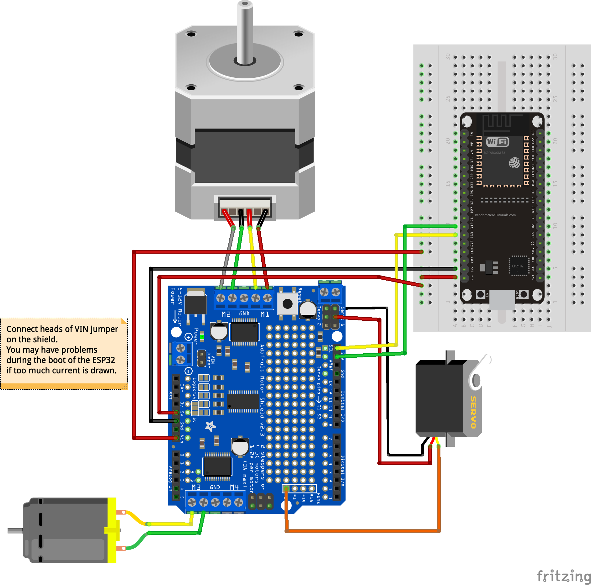

# ESP32 Micropython modules for Adafruit motor shield V2
These are ESP32 Micropython modules for Adafruit's [motor shield v2](https://learn.adafruit.com/adafruit-motor-shield-v2-for-arduino)

* ESP32_pca9685fb.py is a module for driving the PWM timer chip
* ESP32_adamotshv2fb.py is a module for controlling stepper motors, DC motors and servomotors using the shield

Examples of use are in MotorShield_test.py with the following connections, the top one is when you power the motors using the ESP32, the second one is when you use an external power supply.
I had boot problems with some ESP32 boards when not using an external power supply. Plugging the VIN pin after booting solved the issue, but this setup may draw too much current from the ESP32 board.

If you have communications problem over the I2C bus when using DC motors, you should add 100nF capacitors to filter out perturbations as follows:

You may try first with just one capacitor between the two terminals of the motor.

© Frédéric Boulanger <frederic.softdev@gmail.com>  
2019-09-30  
This software is licensed under the Eclipse Public License 2.0
