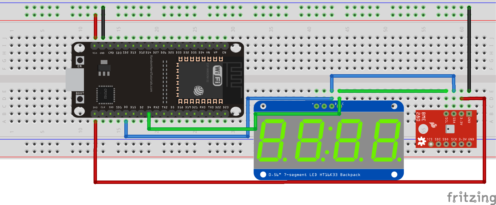

# ESP32 Micropython module for the BME280 sensor
This is an ESP32 Micropython module for the BME280 temperature, pressure and humidity sensor

## Example of use with a 7-segment display
The following diagram shows how to use the BME280 with a 7-segment display (see the [ESP32_HT16K33 module](../HT16K33/)). The code is in [bmedisplay.py](bmedisplay.py).

## Example of use with a websocket/http server
The [server directory](./server/) contains an example of use of the BME280 with a websocket/http server (see the [microserver](../microserver/) directory.

© Frédéric Boulanger <frederic.softdev@gmail.com>  
2019-08-26  – 2020-05-19

This software is licensed under the Eclipse Public License 2.0
