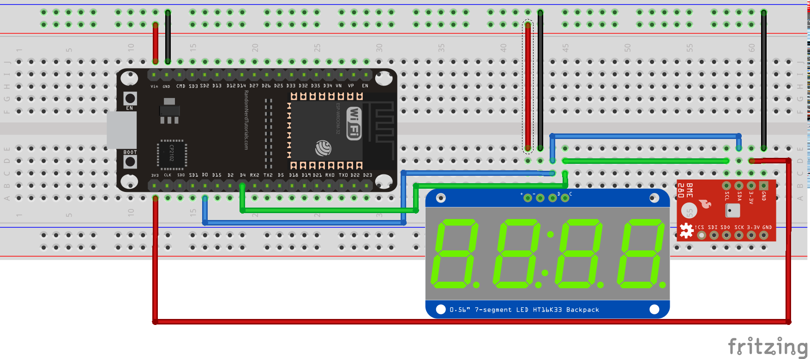

# ESP32 Micropython module for the BME280 sensor
This is an ESP32 Micropython module for the BME280 temperature, pressure and humidity sensor

Here an example of use with a 7-segment display (see the [ESP32_HT16K33 module](../HT16K33/)).

© Frédéric Boulanger <frederic.softdev@gmail.com>  
2019-08-26  
This software is licensed under the Eclipse Public License 2.0
