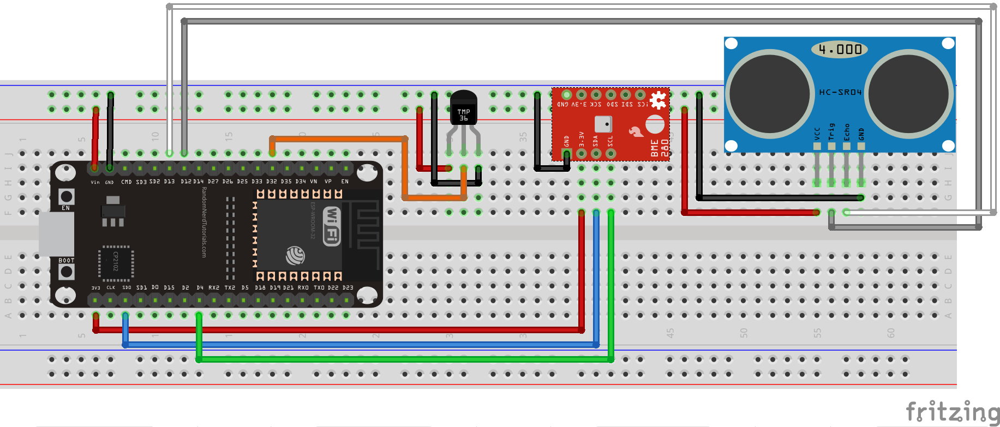

# ESP32 Micropython HCSR04 module
This is an ESP32 Micropython module for the HCSR04 ultrasonic telemeter

I you have a TMP36 or a BME280, you can use it to adjust the speed of sound according to the temperature (see the different test programs in HCSR04_test.py):

© Frédéric Boulanger <frederic.softdev@gmail.com>  
2019-08-28  
This software is licensed under the Eclipse Public License 2.0
