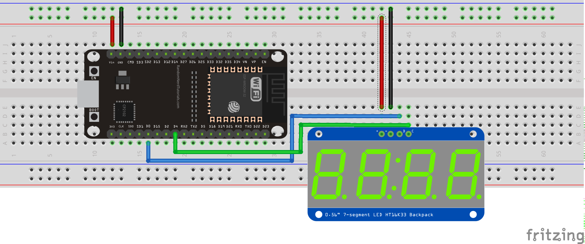

# ESP32 Micropython HT16K33 module
This is an ESP32 Micropython module for Adafruit's 7-segment 4-digit [display with HT16K33 backpack](https://www.adafruit.com/product/879)

Here an example of use

© Frédéric Boulanger <frederic.softdev@gmail.com>  
2019-08-26  
This software is licensed under the Eclipse Public License 2.0
