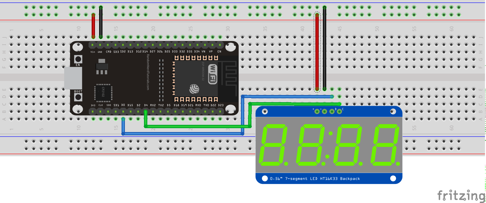

# Pyboard Micropython HT16K334x7 module
This is a pyboard Micropython module for Adafruit's 7-segment 4-digit [display with HT16K33 backpack](https://www.adafruit.com/product/879)

Example of use (execute HT16K334x7_test.py):

© Frédéric Boulanger <frederic.softdev@gmail.com>  
2019-08-27  
This software is licensed under the Eclipse Public License 2.0
