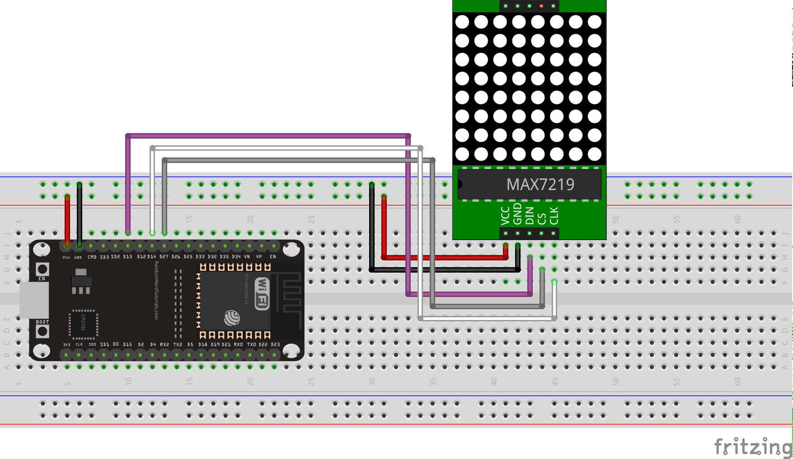

# ESP32 Micropython MAX7219 module
This is an ESP32 Micropython module for the MAX7219 LED driver

The LEDMatrixWithMax module relies on this module to drive an 8 by 8 LED matrix

LEDMatrixExample.py shows how to use the modules, assuming the following connections:

© Frédéric Boulanger <frederic.softdev@gmail.com>  
2019-08-27  
This software is licensed under the Eclipse Public License 2.0
