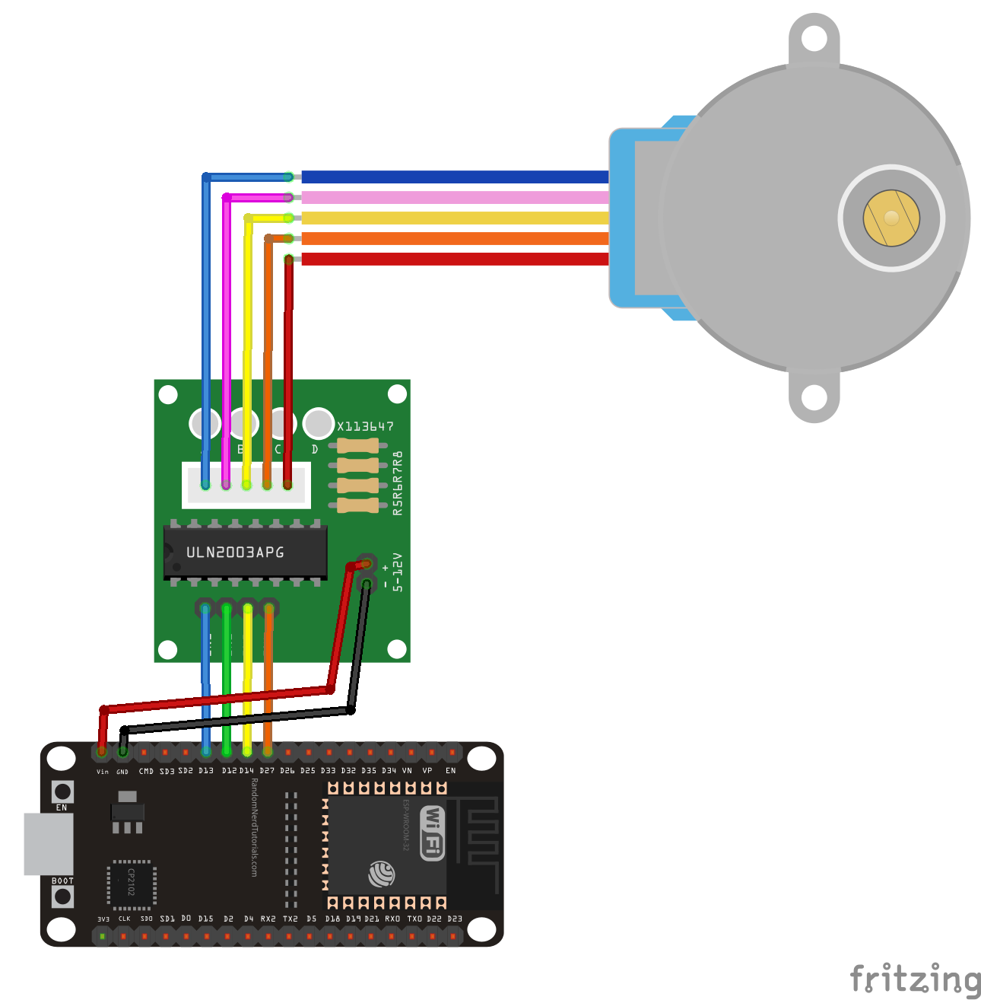

# 28BYJ-48 stepper module
An ESP32 Micropython module for the 28BYJ-48 stepper motor with X113647 driver.

The example file Step28BYJ48_example.py works with the following connections:

© Frédéric Boulanger <frederic.softdev@gmail.com>  
2019-08-28  
This software is licensed under the Eclipse Public License 2.0
