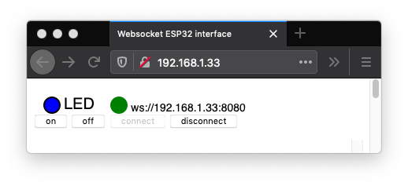

# microserver
This directory contains two modules that provide a very lightweight implementation of a web and a web socket server.

The httpserver module implements a minimalistic HTTP 1.0 server. Its main goal it to be able to serve HTML pages for controlling an ESP32 through a websocket server.

The wsserver module uses the websocket implementation that is available in MicroPython for supporting the web REPL, to implement a simple websocket server that can process line oriented requests.

The ledserver module is an example of use of the two previous modules. Combined with the index.html file (which should be put in a 'www' directory at the root of the file system of the ESP32), it lets you switch on or off, and get the status of the builtin LED of the ESP32.

